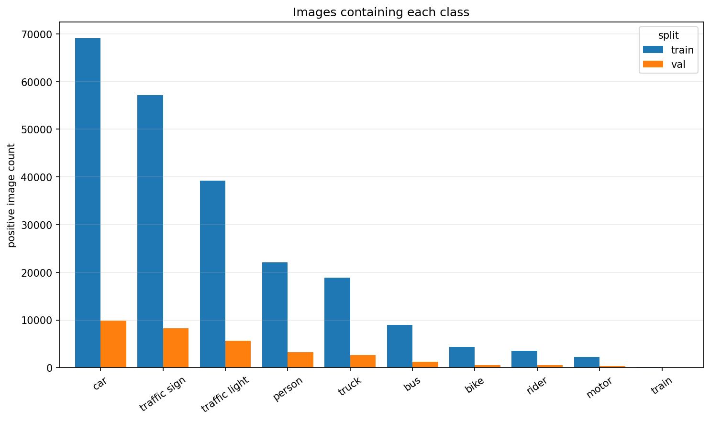
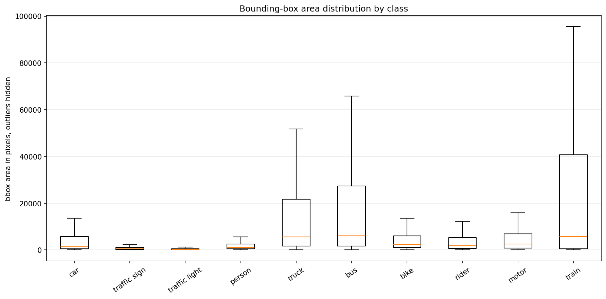
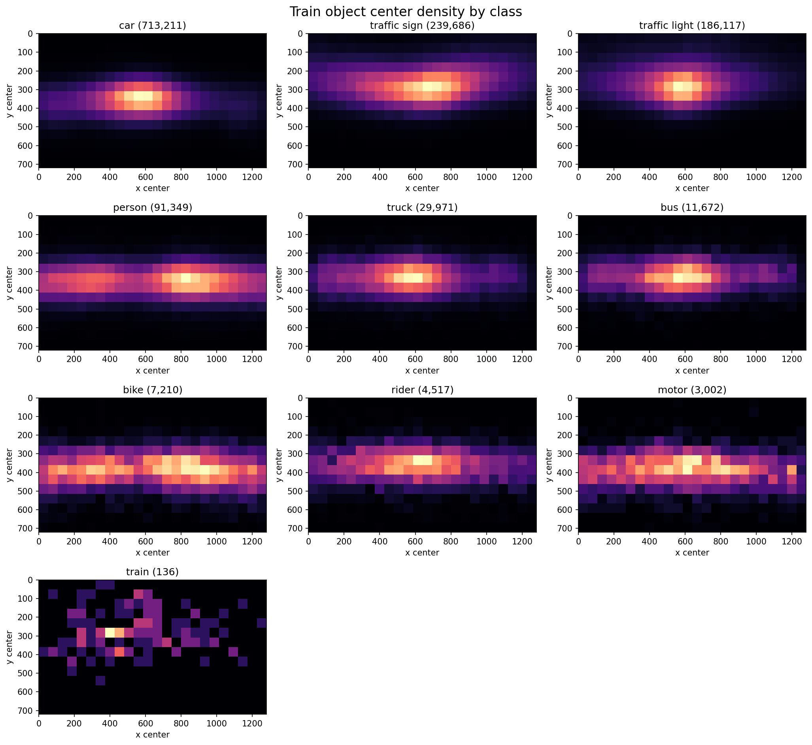
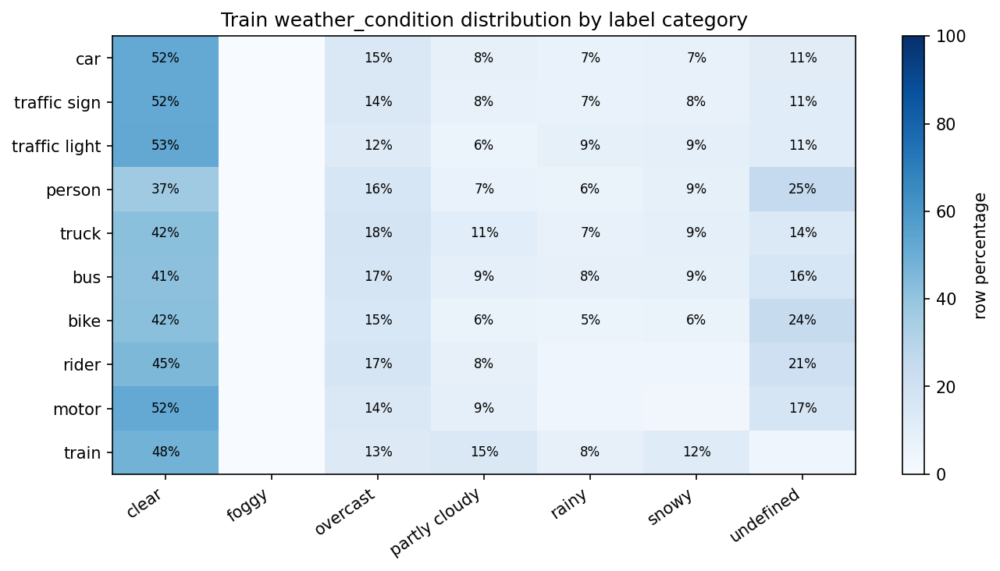

## Observations 
1. The class distribution of train and val sets is same. However, there is heavy class imbalance as can be observed in the graph below:

2. Some classes have very small bounding boxes, indicating that the model that is to be trained on this dataset should be good at small object detection.

3. The train object center density of car and traffic light classes is centered in a limited region. Here, the mosaic and cut-paste augmentations can help.

4. For all weather conditions, their percentage for each class is the same but the percentages of different weather conditions (excluding clear) for each class are imbalanced. Hence, we need to add some weather based augmentations.

5. The above distributions for validation sets are are also similar. This shows that train and val data are well balanced.