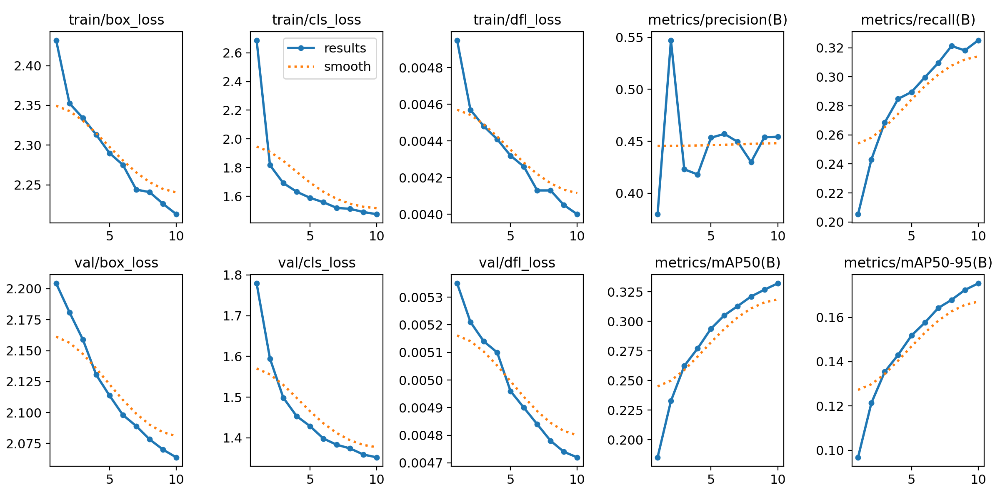
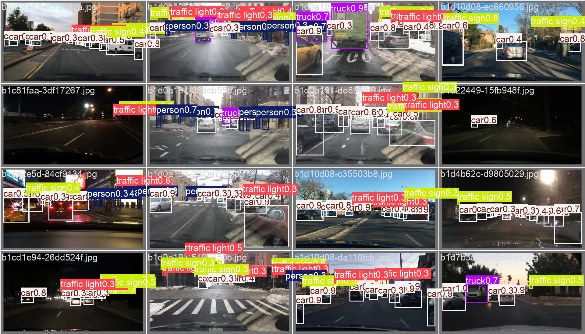
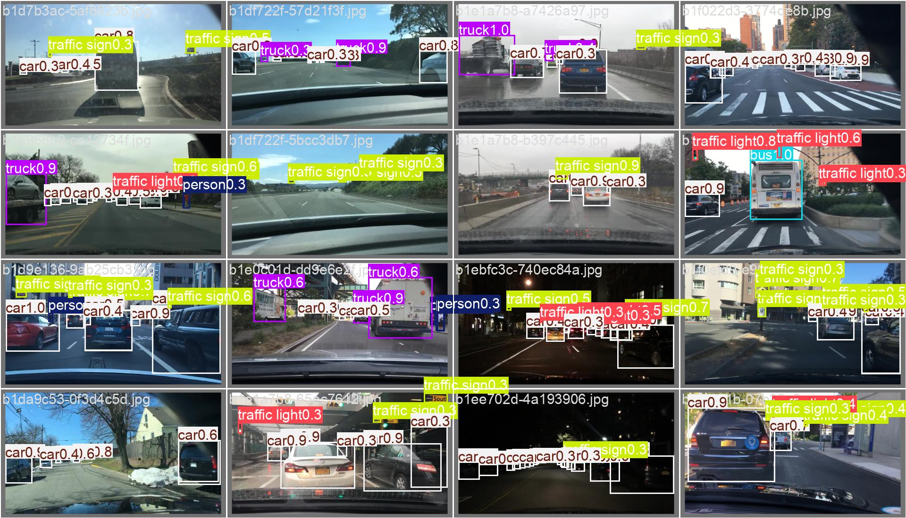

### Training progress
The model is trained for 10 epochs.

1. The train and validation losses decrease steadily with scope for further improvement.
2. Best model metrics
    - Precision: 45.43%
    - Recall: 32.52%
    - mAP@50: 33.32%
    - mAP@50-95: 17.53%

### Inference snapshots

